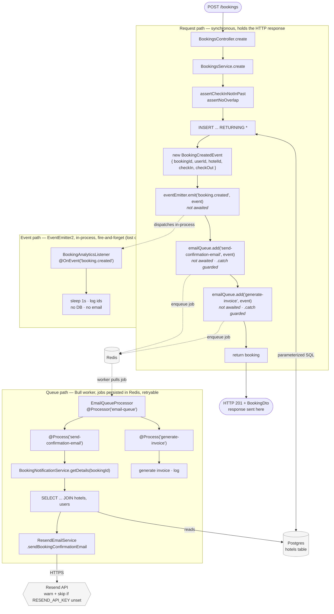

# Booking creation — event and queue flow

Companion to [`docs/logs/005-queue-and-event-driven-bookings.md`](../logs/005-queue-and-event-driven-bookings.md).

When `POST /bookings` succeeds, three things are triggered from
`BookingsService.create()` and **none of them are awaited** before the HTTP
response goes out:

1. **Request path** (solid arrows) — controller → service → validation →
   `INSERT` → build `BookingCreatedEvent` → fire the three calls below →
   `return booking`. The `201` + `BookingDto` is sent at that `return`, before
   any of the async work has necessarily finished.
2. **Event path** (`EventEmitter2`) — in-process, fire-and-forget. `emit()`
   dispatches synchronously to `@OnEvent` handlers but does not wait for their
   async bodies. Lost if the process dies mid-dispatch — which is why only
   analytics (a log line) rides this path.
3. **Queue path** (Bull) — `queue.add()` writes a job to Redis and is
   `.catch()`-guarded so a Redis outage logs instead of throwing an unhandled
   rejection. Jobs persist in Redis, so `send-confirmation-email` /
   `generate-invoice` survive a restart and can be retried. The
   `EmailQueueProcessor` worker runs in the same process and picks jobs up off
   Redis independently of the request.

The event/queue split maps to one question: *does this work need to survive a
crash or retry?* Yes → Bull. No → the emitter.

## App-level wiring behind the diagram

- `EventEmitterModule.forRoot()`, `QueueModule` (`@Global()`, owns the one Redis
  connection via `BullModule.forRootAsync`), and `QueueBoardModule` (Bull Board
  UI at `/queues`) are added in `src/app.module.ts`.
- `BookingsModule` registers the `email-queue` (`BullModule.registerQueue`) and
  adds `BookingNotificationService`, `ResendEmailService`,
  `BookingAnalyticsListener`, `EmailQueueProcessor` to `providers`.
- The queue name lives in its own file, `src/bookings/bookings.constants.ts`
  (`EMAIL_QUEUE = 'email-queue'`), to break a `bookings.module` ↔
  `bookings.service` import cycle.
